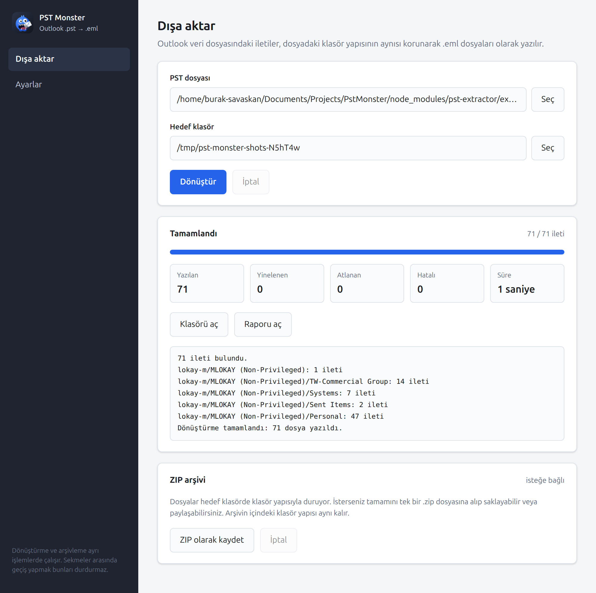
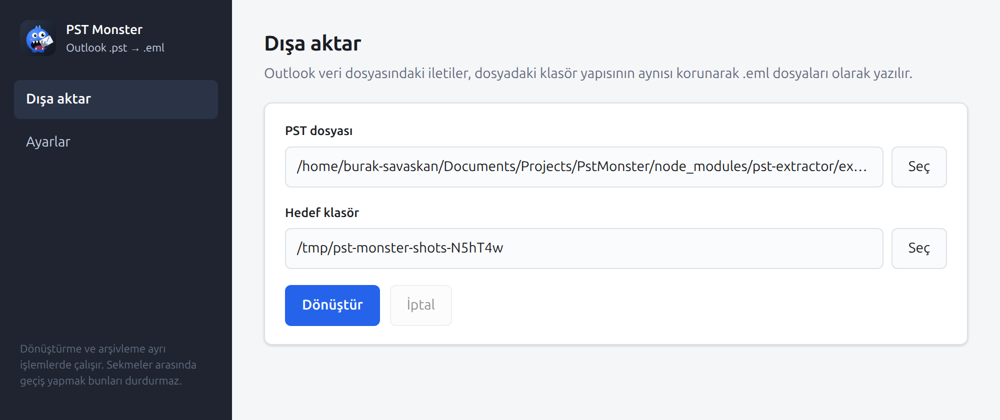
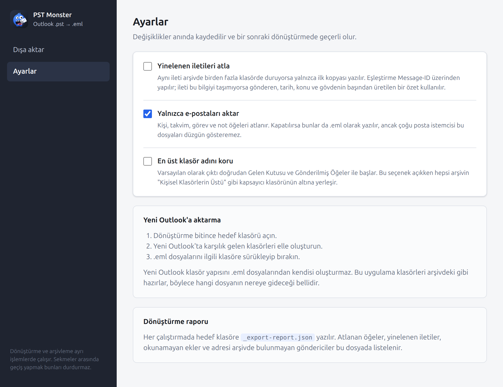

<div align="center">


# PST Monster

**Outlook `.pst` arşivlerini yutar, yeni Outlook'un içe aktarabildiği `.eml` dosyaları çıkarır.**
Klasör yapısı birebir korunur.

[](LICENSE)
[](https://github.com/buraksv/pst-monster/actions/workflows/ci.yml)
[](https://github.com/buraksv/pst-monster/releases)


[İndir](#indir) · [Kullanım](#kullanım) · [Nasıl çalışır](#dönüştürme-kuralları) · [Geliştirme](#geliştirme) · [English](README.en.md)



</div>

---

Yeni Outlook `.pst` dosyası içe aktarmayı kabul etmiyor, tek tek `.eml` dosyası istiyor. PST
Monster arşivinizdeki iletileri, klasör yapısını koruyarak `.eml` dosyalarına çevirir. Ücretsiz,
açık kaynak ve tamamen çevrimdışıdır.

- **Klasör yapısı korunur.** Gelen Kutusu, Gönderilmiş Öğeler ve altındaki her klasör çıktıda aynen oluşur.
- **Hiçbir şey kaybolmaz.** Ekler, gömülü iletiler, satır içi görseller ve özgün internet başlıkları aktarılır.
- **Türkçe karakterler doğru okunur.** Eski Windows kod sayfaları çözülür.
- **Yinelenen iletiler atlanabilir.** İsteğe bağlı, `Message-ID` veya içerik özeti üzerinden.
- **Tek tıkla ZIP.** Tüm çıktı, klasör yapısı korunarak tek bir arşive alınabilir.
- **Her şey yerelde kalır.** Uygulama internete hiç çıkmaz, hiçbir veri hiçbir yere gönderilmez.

<a id="indir"></a>

## İndir

[Sürümler sayfasından](https://github.com/buraksv/pst-monster/releases/latest) işletim sisteminize
uygun dosyayı indirin. **Başka bir şey kurmanıza gerek yok**; çalışma ortamı, uygulama ve tüm
bağımlılıklar paketin içindedir.

> Her sürümün altında GitHub'ın kendi eklediği **Source code (zip)** ve **Source code (tar.gz)**
> bağlantıları da görünür. Bunlar uygulamanın kendisi değil, deponun kaynak kodudur; indirirseniz
> içinde `src/`, `package.json` gibi dosyalar çıkar. Kurulacak dosyalar aşağıdaki tabloda adı
> geçenlerdir, örneğin Windows için `.exe` uzantılı olan.

| İşletim sistemi | Dosya | Ne yapar |
| --- | --- | --- |
| **Windows 10/11** | `pst-monster-*-windows-setup.exe` | Kurulum sihirbazı, Başlat menüsüne ekler |
| Windows, kurulumsuz | `pst-monster-*-windows-portable.exe` | Çift tıkla çalışır, kurulum yapmaz |
| **macOS, Apple Silicon** | `pst-monster-*-macos-arm64.dmg` | M1 ve sonrası |
| **macOS, Intel** | `pst-monster-*-macos-x64.dmg` | 2020 ve öncesi Mac'ler |
| **Ubuntu, Debian** | `pst-monster-*-linux-amd64.deb` | Çift tıkla kurulur |
| Diğer Linux | `pst-monster-*-linux-x64.tar.gz` | Çıkar, `pst-monster` dosyasına çift tıkla |
| Linux, AppImage | `pst-monster-*-linux-x86_64.AppImage` | FUSE gerektirir, aşağıdaki nota bakın |

### İlk açılışta çıkan uyarılar

Paketler kod imzalama sertifikasıyla imzalanmamıştır. Sertifikalar ücretlidir ve bu proje için
alınmamıştır. Uygulama güvenlidir, kaynak kodu bu depodadır, ancak işletim sistemleri imzasız
uygulamaları ilk açılışta bir kez sorar.

<details>
<summary><b>Windows:</b> "Windows bilgisayarınızı korudu" uyarısı</summary>

<br>

SmartScreen mavi bir pencere gösterir. **Ek bilgi** bağlantısına, sonra **Yine de çalıştır**
düğmesine tıklayın. Bu yalnızca ilk açılışta olur.

</details>

<details>
<summary><b>macOS:</b> "Geliştirici doğrulanamadığı için açılamıyor" uyarısı</summary>

<br>

DMG dosyasını açıp uygulamayı **Applications** klasörüne sürükleyin, sonra:

1. Uygulamaya **sağ tıklayın** (veya Control tuşuyla tıklayın) ve **Aç**'ı seçin.
2. Çıkan pencerede yine **Aç**'a basın.

Uyarı sürerse Terminal'de şunu çalıştırın:

```bash
xattr -dr com.apple.quarantine "/Applications/PST Monster.app"
```

</details>

<details>
<summary><b>Ubuntu:</b> AppImage açılmıyor, "Cannot mount AppImage" diyor</summary>

<br>

Ubuntu 22.04 ve sonrasında AppImage'in ihtiyaç duyduğu `libfuse2` kurulu gelmiyor. İki seçenek var:

- **Önerilen:** AppImage yerine `.deb` dosyasını indirin. Hiçbir ek kuruluma gerek kalmaz.
- Ya da `.tar.gz` dosyasını indirip çıkarın, içindeki `pst-monster` dosyasını çalıştırın.

AppImage'i illa kullanmak isterseniz `sudo apt install libfuse2t64` yeterlidir.

</details>

## Kullanım



**Dışa aktar** ekranında iki alan var: kaynak `.pst` dosyası ve `.eml` dosyalarının yazılacağı
hedef klasör. İkisini de seçince **Dönüştür** etkinleşir.

Çalışırken ilerleme, işlenen klasör ve bir günlük görünür. **İptal** işlenmekte olan iletiden
sonra durur; o ana kadar yazılan dosyalar kalır.

Bitince özet çıkar: kaç dosya yazıldı, kaçı yinelenen diye atlandı, kaçında hata oldu.
**Klasörü aç** ile sonuca, **Raporu aç** ile ayrıntılı rapora ulaşırsınız.

### ZIP arşivi

Dönüştürme bitince ekranda bir **ZIP arşivi** bölümü açılır. `.eml` dosyaları hedef klasörde
klasör yapısıyla durmaya devam eder; ZIP bunun yerine geçmez, isteğe bağlı ek bir adımdır.
Butona basınca kaydetme penceresi açılır, sonra ilerleme görünür ve istenirse durdurulabilir.
Durdurulursa yarım kalan dosya silinir, `.eml` dosyalarına dokunulmaz.

Arşivin içindeki klasör yapısı çıktı klasörüyle aynıdır. Arşivi çıktı klasörünün içine
kaydederseniz kendini dışarıda bırakır.

### Ayarlar



| Seçenek | Varsayılan | Ne yapar |
| --- | --- | --- |
| Yinelenen iletileri atla | Kapalı | Aynı ileti birden fazla klasörde duruyorsa yalnızca ilki yazılır |
| Yalnızca e-postaları aktar | Açık | Kişi, takvim, görev ve not öğeleri atlanır |
| En üst klasör adını koru | Kapalı | Çıktıyı arşivin kapsayıcı klasörünün altına yerleştirir |

### Yeni Outlook'a aktarma

Yeni Outlook klasör yapısını `.eml` dosyalarından kendisi kurmaz. Hedef klasördeki ağacı görüp
karşılık gelen klasörleri Outlook'ta oluşturun, sonra dosyaları sürükleyip bırakın.

## Çıktı düzeni

```text
cikti/
├── Gelen Kutusu/
│   ├── 2023-05-04_102030_Teklif hakkında.eml
│   ├── 2023-05-06_081500_(no subject).eml
│   └── Müşteriler/
│       └── 2023-06-01_143012_Sipariş onayı.eml
├── Gönderilmiş Öğeler/
└── _export-report.json
```

Dosya adları `YYYY-AA-GG_SSDDSN_konu.eml` biçimindedir, böylece klasör kronolojik sıralanır.
Adlar üç işletim sisteminde de geçerli olacak şekilde temizlenir: Windows'un yasakladığı
karakterler, ayrılmış aygıt adları (`CON`, `COM1`) ve sondaki nokta ile boşluklar ele alınır.
Aynı ada sahip iki ileti çakışmaz, ikincisine `_2` eklenir.

Yalnızca ileti içeren klasörler oluşturulur. Arşivdeki boş klasörler çıktıda yer almaz.

## Dönüştürme kuralları

<details>
<summary><b>Başlıklar</b></summary>

<br>

İnternet üzerinden gelen iletilerde arşiv genellikle özgün başlıkları saklar; bunlar aktarılır.
`Content-Type`, `Content-Transfer-Encoding` ve `MIME-Version` gibi eski gövdeyi tanımlayan
başlıklar çıkarılır, çünkü gövde yeni sınırlarla yeniden kodlanır. `From`, `To`, `Date` gibi
başlıklar ileti özelliklerinden yeniden üretilir. `Bcc` korunur: bu bir arşiv, gönderilecek bir
posta değil.

Gerçek arşivlerde, katlanmış başlık satırlarını daha önce düzleştirmiş bir aracın bıraktığı
`17: 04:44 -0500` gibi parçalar bulunur. Başlık adı harfle başlamıyorsa atılır.

</details>

<details>
<summary><b>Adresler</b></summary>

<br>

Adres bilgisi öncelikle özgün başlıklardan alınır. Exchange içi iletilerde bu başlıklar yoktur
ve arşiv posta adresi yerine X.500 dizin adı tutar. Bu durumda ad `kişi@x500.invalid` biçimine
çevrilir ve rapora not düşülür. `.invalid` uzantısı RFC 2606 ile ayrılmıştır, hiçbir zaman
çözümlenmez; yani adresin gerçek olmadığı bellidir.

</details>

<details>
<summary><b>Gövde ve Türkçe karakterler</b></summary>

<br>

Düz metin ve HTML birlikte varsa `multipart/alternative` üretilir. İkisi de yoksa zengin metin
gövdesi çözülür: Outlook kendi yazdığı iletilerde özgün HTML'i RTF içine gömdüğü için genelde
gerçek HTML geri kazanılır. Gerçekten zengin metin olan gövdelerde biçimlendirme atılır, metin
korunur.

Eski Outlook sürümleri Türkçe metni `cp1254` gibi Windows kod sayfalarıyla saklar. Bunlar
çözülür, `ş ğ ı İ Ç Ö Ü` karakterleri kaybolmaz.

</details>

<details>
<summary><b>Ekler</b></summary>

<br>

Doğrudan saklanan ekler bayt bayt aktarılır. Gömülü iletiler özyinelemeli olarak `.eml` üretilip
`message/rfc822` eki olarak eklenir. Gövdede `cid:` ile anılan görseller satır içi kalır.
Yalnızca dış dosyaya bağlantı olarak saklanmış ekler arşivde bulunmaz; bunlar rapora yazılır.
Arşiv genel bir MIME tipi bildirmişse uzantıdan türetilen tip kullanılır, böylece görseller ve
PDF'ler istemcide önizlenebilir.

</details>

<details>
<summary><b>Yinelenen tespiti ve arşivleme</b></summary>

<br>

Yinelenen anahtarı `Message-ID`'dir. İleti bu bilgiyi taşımıyorsa gönderen, saniye
çözünürlüğündeki tarih, konu ve gövdenin ilk 4 KB'ından bir özet üretilir. Kapsam tüm
çalıştırmadır: aynı ileti iki klasörde varsa ilk gezilen klasöre yazılır.

Arşivlemede dosyalar diskten tek tek okunup zip'e akıtılır, bu yüzden gigabaytlarca çıktı da
küçük bir çıktı kadar bellek harcar. Sıkıştırma seviyesi 6.

</details>

## Rapor

Hedef klasöre yazılan `_export-report.json` şunları içerir:

- Sayımlar: taranan, işlenen, yazılan, yinelenen, atlanan, hatalı.
- Atlanan her öğe ve nedeni.
- Okunamayan ek, tarihsiz ileti, X.500 gönderen gibi her uyarı.

Taranan sayısı ile işlenen sayısı bazen tutmaz. Outlook klasör sayaçları her zaman gerçek ileti
sayısını vermez, özellikle `.ost` dosyalarında. Rapor ikisini de gösterir.

## Geliştirme

Node.js 22 ve npm gerekir.

```bash
git clone https://github.com/buraksv/pst-monster.git
cd pst-monster
npm install
npm run dev          # geliştirme modunda açar
npm run build        # tip denetimi + derleme
npm test             # 115 birim ve uçtan uca test
npm run verify       # derleme + testler + pencere duman testi
```

Kurulabilir paket üretmek için, her biri kendi işletim sisteminde:

```bash
npm run pack:linux   # .deb, .tar.gz, AppImage
npm run pack:win     # kurulum ve taşınabilir .exe
npm run pack:mac     # dmg ve zip
```

Çıktılar `release/` altına düşer. Windows paketini Linux'ta, macOS paketini Windows'ta
üretemezsiniz; bunu GitHub Actions yapar.

Arayüz olmadan, komut satırından denemek için:

```bash
npm run cli -- arsiv.pst ./cikti --ignore-duplicates
```

### Sürümler ve pipeline'lar

Hiçbir şey push ile otomatik tetiklenmez. Sürüm çıkarmak iki adımdır ve ikisini de Actions
sekmesinden elle başlatırsınız.

**1. Sürümü artırın.** İki pipeline var, ikisi de yalnızca numarayı değiştirir, hiçbir şey
derlemez:

| Pipeline | Ne yapar |
| --- | --- |
| [Increase minor version](.github/workflows/increase-minor-version.yml) | `1.4.0 → 1.5.0` |
| [Increase major version](.github/workflows/increase-major-version.yml) | `1.4.0 → 2.0.0` |

Çalıştırdığınızda yeni numara `package.json`'a yazılır ve `main`'e commit'lenir. Başka hiçbir
şey olmaz: etiket atılmaz, boş bir Release açılmaz. Etiketin karşılığı olmayan bir Release,
ziyaretçinin yanlışlıkla indireceği bir kaynak kodu zip'inden başka bir şey üretmez.

**2. Paketleri üretin.** Üç build pipeline'ını istediğiniz sırada, istediğiniz zaman elle
çalıştırın:

- [Build Linux](.github/workflows/build-linux.yml) → `.deb`, `.tar.gz`, `.AppImage`
- [Build Windows](.github/workflows/build-windows.yml) → kurulum ve taşınabilir `.exe`
- [Build macOS](.github/workflows/build-macos.yml) → Apple Silicon ve Intel için `.dmg` ve `.zip`

Her biri `package.json`'daki sürümü derler, testleri koşturur ve ürettiği paketleri o sürümün
Release'inin **Assets** bölümüne ekler. İlk çalışan build, Release'i ve etiketini birlikte
oluşturur.

**Release hemen yayınlanır.** Bir build biter bitmez paketleri indirilebilir olur; diğer işletim
sistemleri beklenmez. Windows build'i başarılı olup macOS çökerse, Windows `.exe` dosyası yine de
o an indirilebilir durumdadır. Sürüm notlarındaki tablo hangi sistemin paketinin henüz gelmediğini
açıkça yazar, yani kimse yanıltılmaz.

Bir paketi yeniden derlerseniz eskisinin yerine geçer, kopyası oluşmaz. `SHA256SUMS.txt` de her
yüklemede güncellenir: diğer işletim sistemlerinin satırları korunur, yalnızca yeniden derilenler
yenilenir.

Bir sonraki numaranın ne olacağını görmek için:

```bash
npm run version:next -- minor
npm run version:next -- major
```

[`ci.yml`](.github/workflows/ci.yml) bunlardan bağımsızdır; pull request'lerde üç işletim
sisteminde tip denetimi, birim testleri, derleme ve duman testlerini çalıştırır.

> Sürüm pipeline'ları `main`'e commit attığı için depoda **Settings → Actions → General →
> Workflow permissions** ayarı **Read and write** olmalıdır. `main` dalında branch protection
> açıksa ayrıca ya yönetici istisnası tanımlayın ya da `GITHUB_TOKEN` yerine bir PAT kullanın.

### Mimari

```text
src/
├── core/        Electron'dan bağımsız çekirdek, birim testli
│   ├── converter.ts     Akışı yönetir: tara, gez, yaz, raporla
│   ├── pst-walker.ts    Klasör ağacını gezer
│   ├── pst-reader.ts    PSTMessage → biçimden bağımsız ileti
│   ├── eml-builder.ts   İleti → .eml baytları
│   ├── naming.ts        Dosya ve klasör adlarını güvenli hale getirir
│   ├── dedupe.ts        Yinelenen anahtarı ve takibi
│   ├── rtf.ts           RTF gövdesinden HTML veya metin
│   └── archive.ts       Çıktı klasörünü .zip dosyasına akıtır
├── shared/      Pencere ile ana süreç arasındaki sözleşme
├── main/        Electron ana süreci, IPC, ayarlar, worker yönetimi
├── preload/     contextBridge köprüsü
└── renderer/    React arayüzü
```

Dönüştürme ve arşivleme `utilityProcess` ile ayrı işlemlerde çalışır. İkisi de senkron ve CPU
yoğundur; ana süreçte koşsalar pencere donardı. Pencere dosya sistemine hiç dokunmaz:
`contextIsolation` açık, `nodeIntegration` kapalı, `sandbox` açık ve her istek IPC'den geçer.

### Bağımlılıklar

| Paket | Ne için |
| --- | --- |
| [`pst-extractor`](https://github.com/prof3ssorSt3v3/pst-extractor) | PST okuma. Saf JavaScript, üç platformda da derleme gerektirmez |
| [`nodemailer`](https://nodemailer.com) | Yalnızca `MailComposer`, RFC 5322 üretimi için. SMTP kullanılmaz |
| [`rtf-stream-parser`](https://github.com/mazira/rtf-stream-parser) | RTF içine gömülü HTML'i geri çıkarır |
| [`iconv-lite`](https://github.com/ashtuchkin/iconv-lite) | Eski Windows kod sayfalarını çözer |
| [`archiver`](https://github.com/archiverjs/node-archiver) | Zip üretimi |

### Testler

```bash
npm test              # birim ve uçtan uca testler
npm run smoke:worker  # gerçek worker süreçlerinde dönüştürme ve arşivleme
npm run smoke:window  # pencere, köprü ve IPC
```

Uçtan uca test `pst-extractor` ile gelen gerçek bir Outlook arşivini kullanır. O dosyanın
başlıkları zaten bozuktur, bu da aracın dayanıklılığını sınamak için isabetlidir.

Depodaki ekran görüntüleri `npm run capture` ile, uygulama gerçekten çalıştırılarak üretilir.
Uygulama ikonunun kaynağı [`resources/icon.svg`](resources/icon.svg) dosyasıdır; `icon.png`
ondan 1024×1024 olarak üretilir.

## Bilinen sınırlar

- Şifreli PST'lerden yalnızca Outlook'un sıkıştırılabilir şifrelemesi desteklenir. Bozuk dosyayı
  önce `scanpst.exe` ile onarın.
- Çok büyük ekler bellekte tam olarak tutulur. Yüzlerce megabaytlık tek bir ek sorun çıkarabilir.
  Arşivleme bundan etkilenmez, dosyaları akıtarak yazar.
- Paketler imzalanmamıştır; ilk açılışta bir kez onay istenir.
- Arayüz Türkçedir.

## Katkı

Hata bildirimleri ve öneriler için [Issues](https://github.com/buraksv/pst-monster/issues)
sayfasını kullanın. Bir hata bildirirken `_export-report.json` dosyasındaki uyarılar çoğu zaman
sorunun yerini gösterir; iletinin kendisini paylaşmanız gerekmez.

## Lisans

[MIT](LICENSE) · © 2026 Burak Savaşkan
